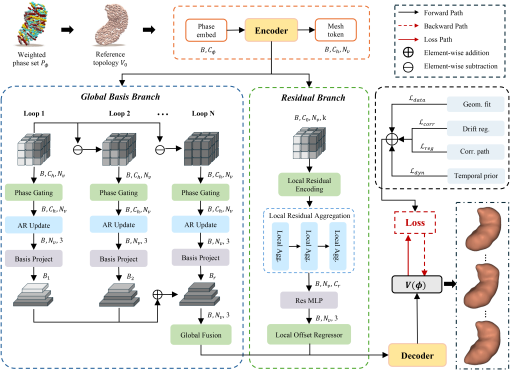
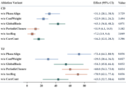

# GBR-4D-Ultrasound

<p align="center">
  <strong>Structured Neural Spatiotemporal Deformation Modeling for 4D Gastric Reconstruction From Freehand Ultrasound</strong>
</p>

<p align="center">
  GBR-4D-Ultrasound addresses 4D gastric reconstruction from sparse, phase-misaligned freehand ultrasound by combining nonlinear phase canonicalization, reliability-aware observation construction, and Global-Basis Residual spatiotemporal deformation modeling within a shared dynamic representation.
</p>

<p align="center">
  <a href="#paper"><strong>Venue</strong></a>
  &nbsp;|&nbsp;
  <a href="#paper"><strong>Paper</strong></a>
  &nbsp;|&nbsp;
  <a href="#dataset"><strong>Data</strong></a>
  &nbsp;|&nbsp;
  <a href="#quick-start"><strong>Code</strong></a>
</p>

<p align="center">
  <a href="#abstract"><strong>Abstract</strong></a>
  &nbsp;|&nbsp;
  <a href="#key-contributions"><strong>Contributions</strong></a>
  &nbsp;|&nbsp;
  <a href="#method-figures"><strong>Method</strong></a>
  &nbsp;|&nbsp;
  <a href="#main-results"><strong>Results</strong></a>
  &nbsp;|&nbsp;
  <a href="#quick-start"><strong>Quick Start</strong></a>
  &nbsp;|&nbsp;
  <a href="#citation"><strong>Citation</strong></a>
</p>

## Project Page

GBR-4D-Ultrasound provides the public method core and compact project page for the proposed framework for 4D gastric reconstruction from freehand ultrasound. This release focuses on the main modeling pathway required to canonicalize heterogeneous temporal phases, construct phase-aligned observations under varying acquisition reliability, and recover dynamic gastric geometry with the Global-Basis Residual representation.

## Teaser

<p align="center">
  <strong>Figure 1.</strong> Overview of the proposed pipeline for phase canonicalization, confidence-aware observation aggregation, and Global-Basis Residual dynamic reconstruction.
</p>

<p align="center">
  
</p>

## Abstract

Freehand ultrasound offers a practical route toward bedside gastric motility assessment, yet robust 4D reconstruction remains challenging because observations are sparse, cycle phases are not directly comparable, and acquisition quality varies substantially across time and view. GBR-4D-Ultrasound addresses this problem with a structured pipeline that first canonicalizes temporal phase across cycles, then aggregates heterogeneous observations with reliability-aware weighting, and finally reconstructs dynamic geometry through a shared-topology Global-Basis Residual representation. This public release exposes the core method path used to demonstrate the central modeling idea in the accompanying paper.

The released representation is

$$
V(\phi) = V_0 + \bar{\Delta} + \sum_{r=1}^{R} \alpha_r(\phi) B_r + R_\theta(V_0, \phi)
$$

where $V_0$ is the shared reference topology, $B_r$ are global motion bases, $\alpha_r(\phi)$ are phase-conditioned coefficients, and $R_\theta$ is a local residual field.

## Key Contributions

- Structured dynamic reconstruction with a shared reference topology instead of phase-wise independent fitting.
- Nonlinear cycle canonicalization that enables cross-cycle phase comparability.
- Reliability-aware observation pooling for heterogeneous freehand ultrasound acquisitions.
- A minimal public implementation with one runnable demo and one exported result artifact.

## Paper

The manuscript is currently under final preparation for public release.

- Title: **Structured Neural Spatiotemporal Deformation Modeling for 4D Gastric Reconstruction From Freehand Ultrasound**
- Status: public preprint link to be added
- Repository role: minimal method implementation accompanying the paper

## Method Figures

### Phase-Aligned Observation Construction

<p align="center">
  <strong>Figure 2.</strong> Construction of phase-aligned observations, showing how heterogeneous measurements are reorganized into a canonical temporal domain before downstream dynamic reconstruction.
</p>

<p align="center">
  
</p>

### GBR Dynamic Model

<p align="center">
  <strong>Figure 3.</strong> Hierarchical dynamic representation of the Global-Basis Residual model, combining a shared reference topology, low-rank global motion bases, and phase-conditioned local residual deformation.
</p>

<p align="center">
  
</p>

These figures summarize the core methodological flow without relying on large supplementary assets: observations are first phase-aligned into a canonical temporal domain, then absorbed by a structured dynamic surface model with explicit global and local deformation factors.

## Main Results

Across the task-specific benchmark comprising approximately 280 simulated instances, the proposed method delivers the best overall quantitative performance in both nominal and degraded observation regimes. Relative to the strongest competing baselines, the primary geometry-accuracy and temporal-consistency criteria improve by approximately 17.0% to 22.2%, supporting the claim that phase canonicalization and structured deformation modeling contribute complementary gains.

### Standard Observation Setting

<p align="center">
  <strong>Figure 4.</strong> Quantitative comparison under the standard observation setting, where GBR-4D-Ultrasound achieves the strongest aggregate accuracy among the evaluated reconstruction strategies.
</p>

<p align="center">
  
</p>

### Robustness Under Degraded Observations

<p align="center">
  <strong>Figure 5.</strong> Robustness analysis under sparse-view, pose-perturbed, and image-degraded conditions, indicating that the proposed method preserves a clear performance margin as observation quality deteriorates.
</p>

<p align="center">
  
</p>

### Ablation Summary

<p align="center">
  <strong>Figure 6.</strong> Ablation study isolating the contributions of phase alignment, confidence-aware supervision, structured motion decomposition, and temporal regularization.
</p>

<p align="center">
  
</p>

Taken together, these results indicate that the observed improvement is not attributable to a single design choice. Instead, performance gains emerge from the joint effect of canonical phase alignment, reliability-aware observation pooling, structured low-rank motion modeling, and temporal regularization.

## Quick Start

```bash
python -m venv .venv
source .venv/bin/activate
pip install -e .
python scripts/run_demo.py
```

The demo generates a synthetic periodic surface sequence, canonicalizes timestamps into a standard phase domain, builds weighted phase sets, optimizes the GBR model, and exports a summary file to `demo/outputs/demo_summary.json`.

## Output

Only one export path is intentionally kept in this public release:

- `demo/outputs/demo_summary.json`

The exported JSON contains fitted phase centers, optimization history, per-phase vertex RMSE against synthetic ground truth, and aggregate demo statistics.

## Dataset

The full benchmark dataset is **not included** in this repository.

- Public benchmark release: **coming soon**
- Data card and access notes: **to be added**
- Current repo status: synthetic demo only

This placeholder is intentional so the repository can be published before the external dataset package is finalized.

## Citation

If you use this repository, please cite the accompanying paper. GitHub citation metadata is also provided in `CITATION.cff`.

```bibtex
@article{liu2026gbr4dultrasound,
  title   = {Structured Neural Spatiotemporal Deformation Modeling for 4D Gastric Reconstruction From Freehand Ultrasound},
  author  = {To be finalized},
  journal = {To be updated},
  year    = {2026}
}
```

## License

This repository ships with the **BSD 3-Clause License**.